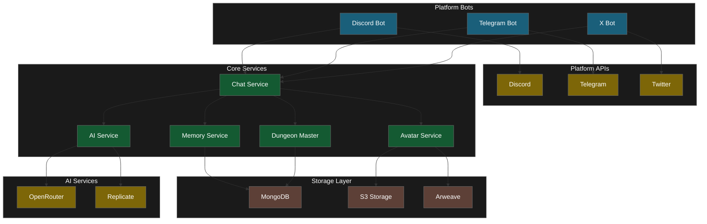

# System Diagram

## System Architecture (Flowchart)

This diagram provides a high-level overview of the system's core components and their interconnections.

It illustrates how the **Platform Bots** interface with external APIs, how the **Core Services** process and manage data, and how these services interact with Storage and AI providers. The diagram shows the system's layered architecture and primary data flow paths.

## Message Flow (Sequence Diagram)

This sequence diagram tracks the lifecycle of a user message through the system.

It demonstrates the interaction between different services, showing how a message flows from initial user input to final response. Each message is enriched with historical context from memory, can trigger media generation, and gets archived for future reference. The diagram illustrates how our services work together in real-time, handling everything from chat responses to image creation and data storage.

**Key Features**

- Message routing connects our agents to users across different platforms
- Context from past conversations informs responses
- AI services generate natural, contextual replies
- Dynamic creation of images and media
- Persistent memory storage for future context
- Real-time processing and response delivery

```mermaid
sequenceDiagram
    participant U as User
    participant B as Platform Bot
    participant C as Chat Service
    participant M as Memory Service
    participant A as Avatar Service
    participant AI as AI Service
    participant S as Storage
    U->>B: Send Message
    B->>C: Route Message
    rect rgb(40, 40, 40)
        note right of C: Context Loading
        C->>M: Get Context
        M->>S: Fetch History
        S-->>M: Return History
        M-->>C: Return Context
    end
    rect rgb(40, 40, 40)
        note right of C: Response Generation
        C->>AI: Generate Response
        alt Image Requested
            AI->>A: Generate Image
            A->>S: Store Image
            S-->>A: Return URL
            A-->>AI: Image Details
        end
        AI-->>C: Complete Response
    end
    rect rgb(40, 40, 40)
        note right of C: Memory Storage
        C->>M: Store Interaction
        M->>S: Save Memory
        alt Memory Milestone
            M->>S: Archive to Chain
        end
    end
    C-->>B: Send Response
    B-->>U: Display Message
```

